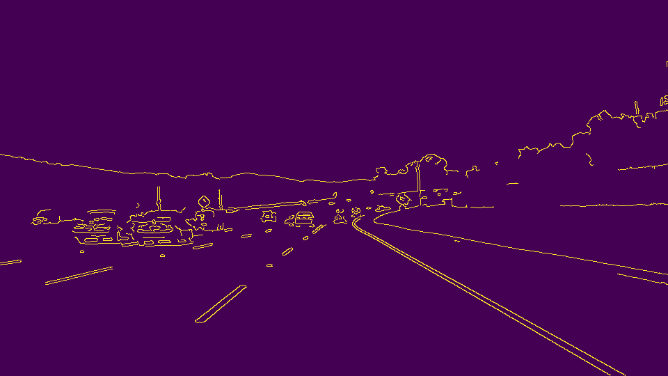
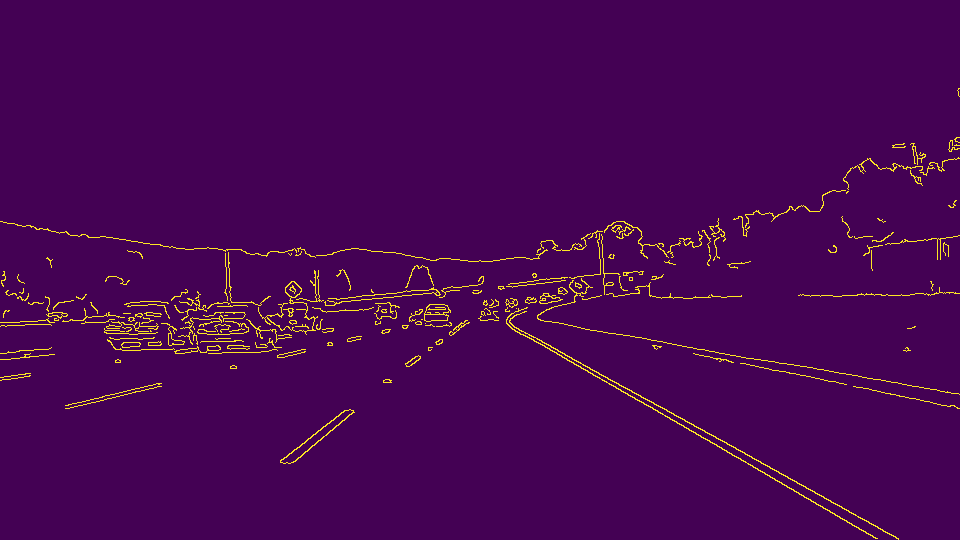
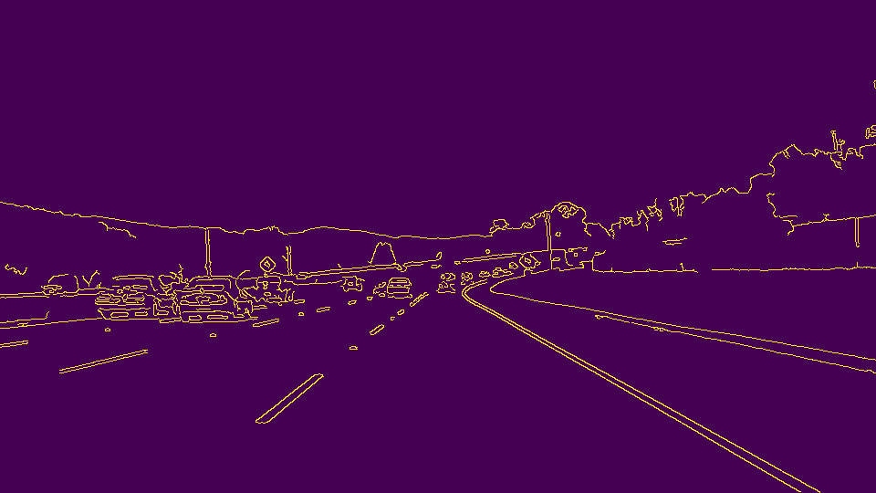

# **Finding Lane Lines on the Road** 

## Writeup Template

### You can use this file as a template for your writeup if you want to submit it as a markdown file. But feel free to use some other method and submit a pdf if you prefer.

---

**Finding Lane Lines on the Road**

The goals / steps of this project are the following:
* Make a pipeline that finds lane lines on the road
* Reflect on your work in a written report

[//]: # (Image References)

[image1]: ./examples/grayscale.jpg "Grayscale"

---

### Reflection

### 1. Describe your pipeline. As part of the description, explain how you modified the draw_lines() function.

My pipeline consisted of 5 steps. Below is tried to explain shortly:
    
   1)Grayscale: It takes a RGB image and convert it to grayscale. 
    
   2)Gaussian Blur: Applied 3x3 gaussian kernel to grayscaled image
    
   3)Canny: Approached 3 different way: One of them is ["OTSU"](https://en.wikipedia.org/wiki/Otsu%27s_method) Thresholding. It assumes an image as a Bimodal distribution and applied only a grayscaled image.Another one is Gaussian Distribution with default sigma 0.33. The last one is manually adjusted by using trial and error.
   
   
   
   
    
   4)Region of Interest(ROI): Extracting a ROI with given values.
    
   5)Predictive Hough Transform: Expressing lines in image in Polar Coordinates as a point.

In order to draw a single line on the left and right lanes, I modified the draw_lines() function.Slope of a line and Intersection of two Points are calculated by using this simple function. And then by using cv2.line() function calculated lines were drawn.

### 2. Identify potential shortcomings with your current pipeline

As you can see in videos my lines are fluctuating. Second one is my pipeline highly sensible to changes in brightness. I recognized thats in challenge video. That's why I send my project without this part. Furthermore, bad weather like heavy foggy or rain would affect camera recognition.

### 3. Suggest possible improvements to your pipeline

A possible improvement would be to extrapolate lines by using betterway. In this way could my pipeline even drawn curve lines in challange video. Another improvement could be automatic recognition of ROI. With given values it is not possible to use directly in every video-frame. 
